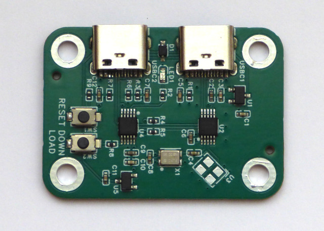

# Si5351 clock generator



Board description: [oshwlab](https://oshwlab.com/koendv/si5351-clock)

Controller firmware: [github](https://github.com/koendv/si5351-clock-generator)

The BOM, Pick and Place and Netlist files are generated in EasyEDA.

Command used to generate `pcb_analysis.yaml`:
``` 
../../easyeda_parser.py --token-limit 15000 BOM_Board1_PCB1_2026-01-17.xlsx PickAndPlace_PCB1_2026-01-17.xlsx Netlist_PCB1_2026-01-17.enet > output.txt 
```

## Chat with Deepseek

upload of file `pcb_analysis.yaml`

```prompt
Please use English.
This yaml describes a pcb.
Is the file truncated?
```

```prompt
Briefly describe what the circuit does.
```

```prompt
What crystal is used?
```
upload of files `C213404.pdf` and `SI5351A-B.PDF`

```prompt
Derive output frequency range, resolution and noise from the attached datasheets.
Do not infer.
Use SI5351 datasheet for MS5351M.
```

```prompt
Project description is at https://oshwlab.com/koendv/si5351-clock
Project firmware is at https://github.com/koendv/si5351-clock-generator
Do not assume project description or firmware is correct.
Instead, assess correctness.
```

Upload of the arduino sketch for the CH552. Files:
 
- `si5351-clock.ino`
- `si5351mcu.c`
- `si5351mcu.h`
- `si5351reg.h`

```prompt
These are the arduino source files for the microcontroller.
```

```prompt
Could this board be used to generate two outputs with 90 degree phase difference?
Do not generate code yet, first discuss.
```

Upload of files [Si5351_routines.c](files/Si5351_routines.c) and [Si5351SDR.h](files/Si5351SDR.h)

```prompt
Attached source file from a working shortwave radio project.
The radio uses the Si5351 quadrature output to demodulate AM.
See https://circuitsalad.com/2020/01/06/compact-si5351-based-sdr/ 
This is known good source to generate quadrature outputs.
```

```prompt
I desire new arduino firmware for the CH552 controller.
New firmware has two modes, normal and quadrature.
Use a simple bool to choose mode.
Mode changes are active after next boot.
Mode does not change after boot.
In quadrature mode, outputs should have a nominal phase difference of 90 degree.
Is my intent clear?
Is this a realistic request?
```

```prompt
What would the frequency range be with quadrature output??
```

```prompt
When in quadrature mode, the firmware should enforce these frequency limits.
Will the code fit in the CH552 controller?
```

```prompt
Drop the frequency sweep self-test to make room.
```

```prompt
Is my intent clear?
```

```prompt
What assumptions are made?
```

```prompt
Do any questions remain?
```

The AI asks what to do with CLK1 - the second clock generator, not used in quadrature mode.

```prompt
Use the simplest option: In quadrature mode, lock CLK1 to CLK0, and disable the 'b' command. OK?
```

```prompt
OK, Proceed. Generate code. Give full source files.
```

The AI outputs new firmware source.

However, do not assume an AI-generated source file is correct.

Instead, consider the AI-generated source file an interesting starting point for a human programmer to begin development.

